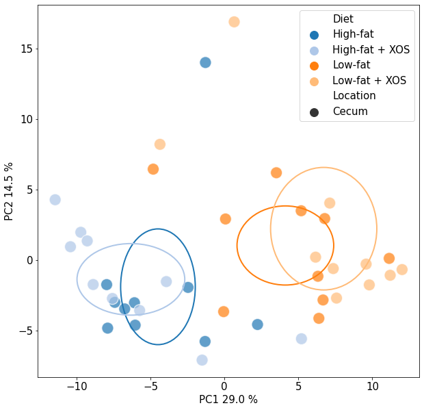
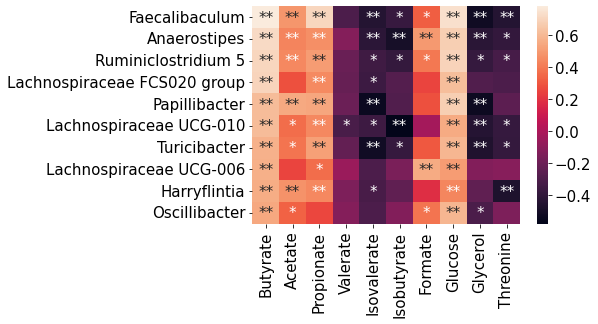

# Demonstration of the functions in the package [jhfuncs](https://github.com/juenhint/jhfuncs)

## Import of packages and example datasets
We'll import the rat study example data[^1], this includes fecal metabolites, fecal microbes and phenotype data.

[^1]: Hintikka J, Lensu S, Mäkinen E, Karvinen S, Honkanen M, Lindén J, Garrels T, Pekkala S, Lahti L. Xylo-Oligosaccharides in Prevention of Hepatic Steatosis and Adipose Tissue Inflammation: Associating Taxonomic and Metabolomic Patterns in Fecal Microbiomes with Biclustering. International Journal of Environmental Research and Public Health. 2021; 18(8):4049. https://doi.org/10.3390/ijerph18084049


```python
import jhfuncs
import pandas as pd
import numpy as np
```


```python
jhfuncs.list_dataset()
```


<div>
<table border="1" class="dataframe">
  <thead>
    <tr style="text-align: right;">
      <th>dataset</th>
      <th>description</th>
      <th>useful</th>
      <th>ref</th>
    </tr>
  </thead>
  <tbody>
    <tr>
      <th>genera</th>
      <td>microbial genera from rat cecum</td>
      <td>all</td>
      <td>jh et al 2021</td>
    </tr>
    <tr>
      <th>metabolites</th>
      <td>fecal metabolites from rat cecum</td>
      <td>all</td>
      <td>jh et al 2021</td>
    </tr>
    <tr>
      <th>metadata</th>
      <td>phenodata for subjects</td>
      <td>all</td>
      <td>jh et al 2021</td>
    </tr>
  </tbody>
</table>
</div>


```python
meb = jhfuncs.read_dataset("metabolites")
mic = jhfuncs.read_dataset("genera")
md = jhfuncs.read_dataset("metadata")
```

The microbial dataset **mic** before transformations:


```python
mic.iloc[13:18,:10]
```


<div>
<table border="1" class="dataframe">
  <thead>
    <tr style="text-align: right;">
      <th></th>
      <th>C1</th>
      <th>C2</th>
      <th>C3</th>
      <th>C4</th>
      <th>C5</th>
      <th>C6</th>
      <th>C7</th>
      <th>C8</th>
      <th>C9</th>
      <th>C10</th>
    </tr>
  </thead>
  <tbody>
    <tr>
      <th>Akkermansia</th>
      <td>285</td>
      <td>3442</td>
      <td>1980</td>
      <td>1557</td>
      <td>1502</td>
      <td>2425</td>
      <td>3332</td>
      <td>5941</td>
      <td>4930</td>
      <td>2342</td>
    </tr>
    <tr>
      <th>Alistipes</th>
      <td>1769</td>
      <td>13698</td>
      <td>15742</td>
      <td>13947</td>
      <td>12667</td>
      <td>6846</td>
      <td>15589</td>
      <td>5753</td>
      <td>12366</td>
      <td>15251</td>
    </tr>
    <tr>
      <th>Allobaculum</th>
      <td>203</td>
      <td>11</td>
      <td>36</td>
      <td>254</td>
      <td>4</td>
      <td>20</td>
      <td>3</td>
      <td>16</td>
      <td>0</td>
      <td>15</td>
    </tr>
    <tr>
      <th>Alloprevotella</th>
      <td>2036</td>
      <td>1783</td>
      <td>1044</td>
      <td>711</td>
      <td>1952</td>
      <td>2277</td>
      <td>1984</td>
      <td>597</td>
      <td>1138</td>
      <td>2238</td>
    </tr>
    <tr>
      <th>Anaerofustis</th>
      <td>0</td>
      <td>3</td>
      <td>1</td>
      <td>0</td>
      <td>3</td>
      <td>4</td>
      <td>4</td>
      <td>5</td>
      <td>6</td>
      <td>4</td>
    </tr>
  </tbody>
</table>
</div>


### Relative frequencies of the microbes
Relative frequencies (% of the total abundance in a sample) for variables, typically microbes, can be calculated with the function 


```python
mic_rf = jhfuncs.relative_frequency(mic)
mic_rf.iloc[13:18,:10]
```


<div>
<table border="1" class="dataframe">
  <thead>
    <tr style="text-align: right;">
      <th></th>
      <th>C1</th>
      <th>C2</th>
      <th>C3</th>
      <th>C4</th>
      <th>C5</th>
      <th>C6</th>
      <th>C7</th>
      <th>C8</th>
      <th>C9</th>
      <th>C10</th>
    </tr>
  </thead>
  <tbody>
    <tr>
      <th>Akkermansia</th>
      <td>0.005106</td>
      <td>0.063407</td>
      <td>0.036381</td>
      <td>0.034285</td>
      <td>0.032208</td>
      <td>0.048022</td>
      <td>0.059674</td>
      <td>0.116650</td>
      <td>0.080615</td>
      <td>0.043233</td>
    </tr>
    <tr>
      <th>Alistipes</th>
      <td>0.031690</td>
      <td>0.252340</td>
      <td>0.289247</td>
      <td>0.307115</td>
      <td>0.271620</td>
      <td>0.135570</td>
      <td>0.279188</td>
      <td>0.112959</td>
      <td>0.202208</td>
      <td>0.281529</td>
    </tr>
    <tr>
      <th>Allobaculum</th>
      <td>0.003637</td>
      <td>0.000203</td>
      <td>0.000661</td>
      <td>0.005593</td>
      <td>0.000086</td>
      <td>0.000396</td>
      <td>0.000054</td>
      <td>0.000314</td>
      <td>0.000000</td>
      <td>0.000277</td>
    </tr>
    <tr>
      <th>Alloprevotella</th>
      <td>0.036473</td>
      <td>0.032846</td>
      <td>0.019183</td>
      <td>0.015656</td>
      <td>0.041857</td>
      <td>0.045091</td>
      <td>0.035532</td>
      <td>0.011722</td>
      <td>0.018608</td>
      <td>0.041313</td>
    </tr>
    <tr>
      <th>Anaerofustis</th>
      <td>0.000000</td>
      <td>0.000055</td>
      <td>0.000018</td>
      <td>0.000000</td>
      <td>0.000064</td>
      <td>0.000079</td>
      <td>0.000072</td>
      <td>0.000098</td>
      <td>0.000098</td>
      <td>0.000074</td>
    </tr>
  </tbody>
</table>
</div>


### CLR-transformation for the microbial data
Center log ratio (clr) -transformation is typically performed on microbial abundances to remove compositional effects. This is done with the function `center_log_ratio`


```python
mic_clr = jhfuncs.center_log_ratio(mic,pseudocount=1)
mic_clr.iloc[13:18,:10]
```


<div>
<table border="1" class="dataframe">
  <thead>
    <tr style="text-align: right;">
      <th></th>
      <th>C1</th>
      <th>C2</th>
      <th>C3</th>
      <th>C4</th>
      <th>C5</th>
      <th>C6</th>
      <th>C7</th>
      <th>C8</th>
      <th>C9</th>
      <th>C10</th>
    </tr>
  </thead>
  <tbody>
    <tr>
      <th>Akkermansia</th>
      <td>2.858261</td>
      <td>5.454839</td>
      <td>4.636128</td>
      <td>4.409510</td>
      <td>4.527259</td>
      <td>4.919120</td>
      <td>5.231711</td>
      <td>5.607690</td>
      <td>5.581683</td>
      <td>4.817474</td>
    </tr>
    <tr>
      <th>Alistipes</th>
      <td>4.681004</td>
      <td>6.835819</td>
      <td>6.708922</td>
      <td>6.601443</td>
      <td>6.658875</td>
      <td>5.956687</td>
      <td>6.774468</td>
      <td>5.575539</td>
      <td>6.501172</td>
      <td>6.690752</td>
    </tr>
    <tr>
      <th>Allobaculum</th>
      <td>2.520389</td>
      <td>-0.204353</td>
      <td>0.655688</td>
      <td>2.599615</td>
      <td>-1.178522</td>
      <td>0.169643</td>
      <td>-1.493622</td>
      <td>-0.248898</td>
      <td>-2.921615</td>
      <td>-0.169125</td>
    </tr>
    <tr>
      <th>Alloprevotella</th>
      <td>4.821503</td>
      <td>4.797354</td>
      <td>3.996543</td>
      <td>3.626429</td>
      <td>4.789162</td>
      <td>4.856174</td>
      <td>4.713457</td>
      <td>3.311480</td>
      <td>4.116291</td>
      <td>4.772071</td>
    </tr>
    <tr>
      <th>Anaerofustis</th>
      <td>-2.797731</td>
      <td>-1.302965</td>
      <td>-2.262082</td>
      <td>-2.941649</td>
      <td>-1.401666</td>
      <td>-1.265441</td>
      <td>-1.270479</td>
      <td>-1.290352</td>
      <td>-0.975704</td>
      <td>-1.332276</td>
    </tr>
  </tbody>
</table>
</div>


### Principal component analysis
We'll apply some dimensionality reduction to the microbial data with the function `plot_PCA`. The scores and the plot are returned as variables which can be manipulated further.


```python
dee, doo = jhfuncs.plot_PCA(mic_clr.T, 
                            group=md["Diet"], 
                            group2=md["Location"], 
                            scatter_kwargs={"alpha":.7, "s":300}, 
                            ellipse_kwargs={"alpha":0.95})
```


    

    


```python
dee.iloc[:10,[0,1]]
```


<div>
<table border="1" class="dataframe">
  <thead>
    <tr style="text-align: right;">
      <th></th>
      <th>0</th>
      <th>1</th>
    </tr>
  </thead>
  <tbody>
    <tr>
      <th>C1</th>
      <td>-1.287515</td>
      <td>14.001312</td>
    </tr>
    <tr>
      <th>C2</th>
      <td>-7.971376</td>
      <td>-1.738521</td>
    </tr>
    <tr>
      <th>C3</th>
      <td>2.237118</td>
      <td>-4.567074</td>
    </tr>
    <tr>
      <th>C4</th>
      <td>-1.312316</td>
      <td>-5.767814</td>
    </tr>
    <tr>
      <th>C5</th>
      <td>-6.092155</td>
      <td>-3.022916</td>
    </tr>
    <tr>
      <th>C6</th>
      <td>-7.419892</td>
      <td>-2.997072</td>
    </tr>
    <tr>
      <th>C7</th>
      <td>-2.467158</td>
      <td>-1.937690</td>
    </tr>
    <tr>
      <th>C8</th>
      <td>-6.753212</td>
      <td>-3.458923</td>
    </tr>
    <tr>
      <th>C9</th>
      <td>-7.905649</td>
      <td>-4.823130</td>
    </tr>
    <tr>
      <th>C10</th>
      <td>-6.044134</td>
      <td>-4.612892</td>
    </tr>
  </tbody>
</table>
</div>


### Correlation 
We can create a correlation matrix between the genera and metabolites using either Pearson's or Spearman's correlation. The functions `pearson_cor` and `spearman_cor` return two matrices for both the coefficients and the p-values.
Let's visualize some of the results in a heatmap.


```python
stat, p = jhfuncs.spearman_cor(mic_clr.T, meb, nan="omit")
```


```python
import seaborn as sns
import matplotlib.pyplot as plt

# Let's find the highest correlations with the metabolite butyrate
data = stat.sort_values("Butyrate", ascending=False).iloc[:10,:10]
sns.heatmap(data)
plt.show()
```


    

    


The function `makeast` is created to annotate statistically significant results easily and according to standard scientific notation. This is usually * for p-values < 0.05 and ** for p-values < 0.01


```python
import seaborn as sns
import matplotlib.pyplot as plt

# Let's find the highest correlations with the metabolite butyrate
data = stat.sort_values("Butyrate", ascending=False).iloc[:10,:10]
annot = jhfuncs.makeast(p.loc[data.index,data.columns])
sns.heatmap(data,annot=annot,fmt="")
plt.show()
```


    

    

